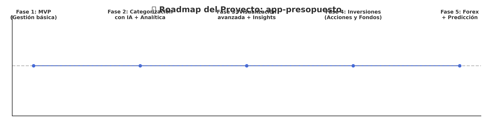

# Sistema de Gestión de Presupuestos

Una aplicación personal de finanzas que integra inteligencia artificial para aprender y mejorar tu manejo del dinero. Está diseñada para ayudarte a gestionar tus ingresos, gastos, deudas, inversiones y ahorro de forma más inteligente.

---

## 📖 Descripción

Este proyecto consiste en el desarrollo de una aplicación para la **gestión personal de finanzas**, centrada en facilitar el control de tus movimientos bancarios, presupuestos y deudas.

Principales funcionalidades:

- Cargar y categorizar automáticamente transacciones bancarias.
- Administrar cuentas, préstamos, tarjetas de crédito y activos financieros.
- Controlar deudas y pagos recurrentes (pagos, consultas médicas, etc.).
- Gestionar inversiones en acciones y fondos.
- Crear presupuestos y comparar el gasto real por categoría.
- Presentar reportes visuales: flujo de caja, resumen mensual, gastos por categoría, desempeño del presupuesto, informes anuales, entre otros.
- Proponer estrategias de pago, como el método de la bola de nieve.
- Futuras versiones: recomendaciones personalizadas de ahorro, inversión y reducción de deuda.

---

## 🗺️ Roadmap

A continuación, el plan de desarrollo del proyecto:



---

## 📂 Estructura del Proyecto

```
/base de datos/              — Scripts SQL (create, foreign keys, vistas, funciones, SP, jobs, datos iniciales)
├── 01_create_tables.sql
├── 02_create_foreign_keys.sql
├── 03_create_views.sql
├── 04_create_functions.sql
├── 05_create_procedures.sql
├── 06_create_jobs.sql
└── 07_insert_data.sql

/presupuesto/                — Backend (API Flask y modelos SQLAlchemy)
controllers/                 — Lógica de negocio y endpoints
models/                      — Modelos de datos
views/                       — Rutas Flask
app-presopuesto.code‑workspace — Configuración del editor
README.md                    — Documentación del proyecto
venv/                        — Entorno virtual (excluido de producción)
```

---

## ⚙️ Instalación

1. Clona el repositorio:

   ```bash
   git clone https://github.com/estebanfabianp/app-presopuesto.git
   cd app-presopuesto
   ```

2. Crea y activa el entorno virtual (opcional pero recomendado):

   ```bash
   python3 -m venv venv
   source venv/bin/activate
   ```

3. Instala las dependencias:

   ```bash
   pip install -r requirements.txt
   ```

4. Inicializa la base de datos:

   ```bash
   mysql -u usuario -p < /base\ de\ datos/01_create_tables.sql
   mysql -u usuario -p < /base\ de\ datos/02_create_foreign_keys.sql
   mysql -u usuario -p < /base\ de\ datos/07_insert_data.sql
   ```

5. Ejecuta la API:

   ```bash
   flask run
   ```

---

## 🚀 Uso

Accede a los endpoints para realizar operaciones como:
- Registro de transacciones
- Consulta de presupuestos y movimientos
- Visualización de resúmenes financieros

---

## 📝 Buenas Prácticas Implementadas

- Integridad referencial con claves primarias y foráneas.
- Tablas de catálogo en lugar de ENUMs para flexibilidad futura.
- Comentarios claros para tablas y columnas.
- Restricciones `CHECK` para asegurar datos válidos.
- Almacenamiento seguro con hash para contraseñas.
- Automatización con procedimientos y jobs (event scheduler de MySQL).

---

## 📊 Ejemplo de Consulta

```sql
-- Resumen de gastos por categoría para un usuario:
SELECT m.categoria, SUM(m.monto) AS total_gastado
FROM movimiento m
JOIN cuenta c ON m.cuenta_id = c.id_cuenta
WHERE c.usuario_id = 1 AND m.tipo = 'gasto'
GROUP BY m.categoria;
```

---

## 👨‍💻 Autor

Desarrollado por **Esteban Fabián Patiño Montealegre**

---

## ℹ Acerca del proyecto

Una app personal basada en IA para aprender Python mientras gestiono mis finanzas.
